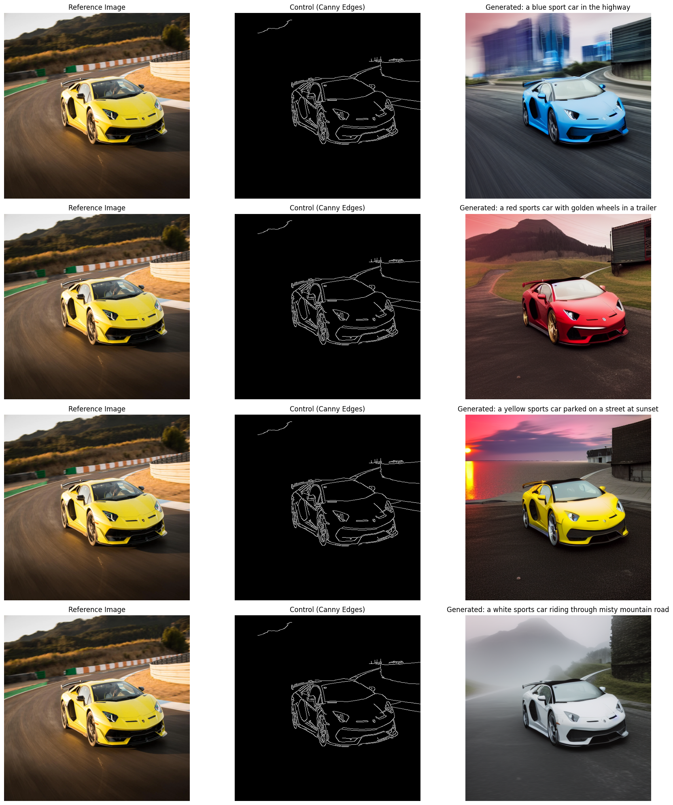
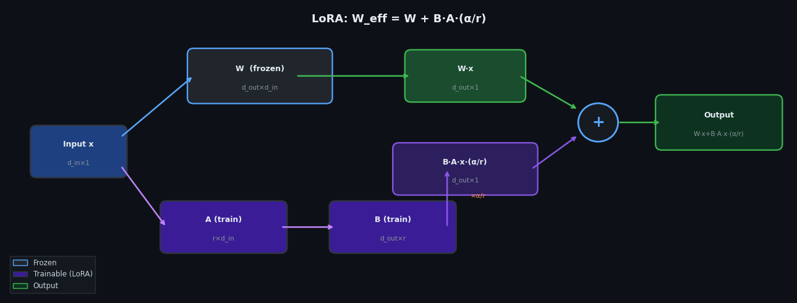

# Diffusion Models Experiments

This repository contains experiments and educational implementations of **diffusion-based generative models** using **PyTorch**.

The goal is to understand how diffusion models work by implementing them from scratch and visualizing their behavior.

---

## Implementations

### DDPM (Denoising Diffusion Probabilistic Model)

Notebook: `DDPM/DDPM.ipynb`

This notebook implements a diffusion model trained on the **MNIST dataset** to generate handwritten digits.

Main features:

- U-Net architecture for noise prediction  
- Sinusoidal timestep embeddings  
- Exponential Moving Average (EMA) for stable sampling  
- Visualization of forward and reverse diffusion  

The model learns to generate digits by **starting from random noise and gradually denoising it**.

<p align="center">
  
</p>

---

### LDM (Latent Diffusion Model)

Notebook: `LDM/LDM.ipynb`

This notebook implements a **Latent Diffusion Model**, where diffusion is performed in a **compressed latent space** instead of directly on image pixels.

The pipeline consists of two stages:

1. **Autoencoder training** – learns a latent representation of the images.
2. **Diffusion training in latent space** – a U-Net learns to denoise latent representations.

Operating in latent space significantly reduces **computational cost and memory usage**, while still allowing high-quality image generation.

Main features:

- Convolutional **Autoencoder** for latent compression
- **Latent-space diffusion training**
- U-Net architecture for noise prediction
- EMA sampling
- Generation of new images by decoding denoised latent vectors

### Generated Samples

<p align="center">
  
</p>

---

### ViT (Vision Transformer)

Notebook: `ViT/ViT.ipynb`

This notebook implements a **Vision Transformer (ViT)** for image classification.

Instead of using convolutional layers, the model processes images as a sequence of **patch embeddings** and applies the **Transformer encoder** architecture.

Main features:

- Image patch embedding
- Positional embeddings
- Transformer encoder blocks
- Multi-head self-attention
- Classification head

The implementation demonstrates how transformer architectures can be applied to computer vision tasks.

<p align="center">
  
</p>

---

### ControlNet

Notebook: `ControlNet/ControlNet.ipynb`

This notebook demonstrates **ControlNet** — a method for adding spatial conditioning to a pre-trained **Stable Diffusion** model. Instead of generating images purely from text, ControlNet allows guiding generation using structural signals such as **Canny edge maps**.

The notebook uses a reference car image, extracts its Canny edges, and feeds the edge map alongside text prompts into a ControlNet-conditioned Stable Diffusion pipeline.

Main features:

- **Canny edge extraction** as a structural conditioning signal
- **Stable Diffusion v1.5** + `lllyasviel/control_v11p_sd15_canny` ControlNet
- `UniPCMultistepScheduler` for fast, high-quality sampling
- Exploring **different text prompts** while preserving the source structure
- Sweeping **ControlNet conditioning scale** (0.1 → 1.0) to analyze structure adherence

### Generated Samples

<p align="center">
  
</p>

---

### LoRA (Low-Rank Adaptation)

Notebook: `LoRA/LoRA.ipynb`

This notebook implements **LoRA** — a parameter-efficient fine-tuning technique that injects trainable low-rank matrices into a pre-trained network's weight layers, leaving the original weights frozen.

The experiment trains an intentionally large MLP (`ExpensiveNet`, ~2.8 M parameters) to classify **MNIST digits**, then fine-tunes it on the digit **9** — on which the baseline performs worst — using only the LoRA parameters.

The effective weight update follows:

```
W_eff = W + B · A · (α / r)
```

where **A** and **B** are the small trainable matrices, **r** is the rank, and **α** is a scaling constant.

Main features:

- Custom `LoRAParametrization` module using PyTorch's `torch.nn.utils.parametrize` API
- Random Gaussian init for **A**, zero init for **B** — ensures Δ W = 0 at training start
- `α / r` scaling to decouple rank from effective learning rate
- Per-layer parameter counting (original vs. LoRA-added)
- Selective freezing: only LoRA matrices are updated during fine-tuning
- Integrity checks asserting original weights are unchanged post fine-tuning
- `enable_disable_lora()` toggle to switch between adapted and original model at inference

<p align="center">
  
</p>

---

### img2dataset (Image Collection)

Scripts: `img2dataset/dataset.py`, `img2dataset/list.txt`

A minimal image collection pipeline for bootstrapping local datasets using the [`img2dataset`](https://github.com/rom1504/img2dataset) library.

The script reads a list of image URLs from `list.txt`, downloads them in parallel, resizes each image to **256×256** using **border padding**, and saves the results to a local `data/` directory. The output directory is wiped on every run to ensure a clean dataset state.

Main features:

- URL-driven collection via a plain `list.txt` file
- Automatic cleanup of existing output before each run
- Resize to 256×256 with `border` mode to preserve aspect ratio
- High-throughput configuration: 32 processes / 256 threads

**Usage:**

```bash
cd img2dataset
python dataset.py
```

---