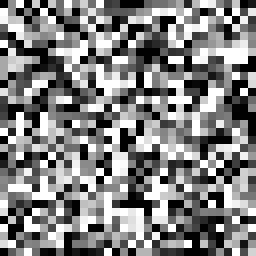
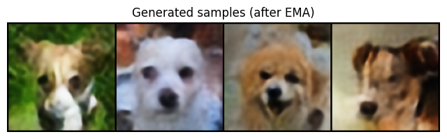
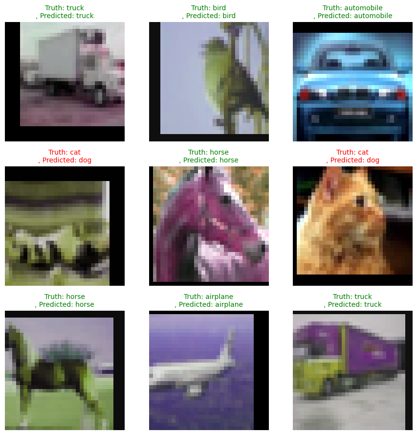

# Diffusion Models Experiments

This repository contains experiments and educational implementations of **diffusion-based generative models** using **PyTorch**.

The goal is to understand how diffusion models work by implementing them from scratch and visualizing their behavior.

---

## Implementations

### DDPM (Denoising Diffusion Probabilistic Model)

Notebook: `DDPM.ipynb`

This notebook implements a diffusion model trained on the **MNIST dataset** to generate handwritten digits.

Main features:

- U-Net architecture for noise prediction  
- Sinusoidal timestep embeddings  
- Exponential Moving Average (EMA) for stable sampling  
- Visualization of forward and reverse diffusion  

The model learns to generate digits by **starting from random noise and gradually denoising it**.

  

---

### LDM (Latent Diffusion Model)

Notebook: `LDM.ipynb`

This notebook implements a **Latent Diffusion Model**, where diffusion is performed in a **compressed latent space** instead of directly on image pixels.

The pipeline consists of two stages:

1. **Autoencoder training** – learns a latent representation of the images.
2. **Diffusion training in latent space** – a U-Net learns to denoise latent representations.

Operating in latent space significantly reduces **computational cost and memory usage**, while still allowing high-quality image generation.

Main features:

- Convolutional **Autoencoder** for latent compression
- **Latent-space diffusion training**
- U-Net architecture for noise prediction
- EMA sampling
- Generation of new images by decoding denoised latent vectors

### Generated Samples

  

---

---

### ViT (Vision Transformer)

Notebook: `ViT.ipynb`

This notebook implements a **Vision Transformer (ViT)** for image classification.

Instead of using convolutional layers, the model processes images as a sequence of **patch embeddings** and applies the **Transformer encoder** architecture.

Main features:

- Image patch embedding
- Positional embeddings
- Transformer encoder blocks
- Multi-head self-attention
- Classification head

The implementation demonstrates how transformer architectures can be applied to computer vision tasks.

  

---